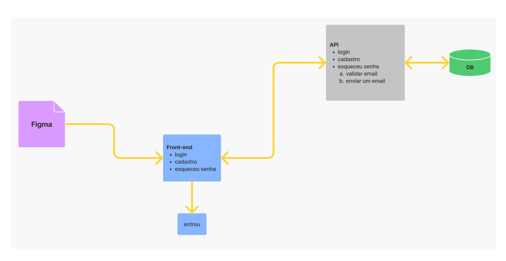

# Third party packages

the following packages are used for better use of git, following the best practices of the conventional commits and semantic version,
you can check the reference for this packages [here (portuguese)](https://dev.to/vitordevsp/padronizacao-de-commit-com-commitlint-husky-e-commitizen-3g1n) or [here (english)](https://mokkapps.de/blog/how-to-automatically-generate-a-helpful-changelog-from-your-git-commit-messages/). 

- commitlint: verify if the commit message follow the conventional commits pattern
- husky: help to create a git hook to execute actions with determinated commands (here we use a hook to execute the commitlint when we execute a new git commit)
- commitzen: generate a interface in the terminal to access all the types of commits and their description
- standard-version: auto generate change logs with the semantic version 

# About

The main objective of this project is to develop the habillity to create a register and login system,
with the recover password option. 

Here is the [link for the design on figma](https://www.figma.com/file/GPhU0H4Yfo9gjLWXALyPbm/React-native-challenge?node-id=0%3A1). 

# Getting Started

First clone the repository: `git clone https://github.com/ThiagoA20/frontend-challenge.git` 

Run `npm install`

# Overview

1. Project Architecture 
